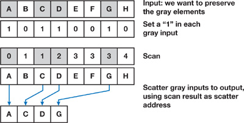

CUDA Stream Compaction
======================

This project implements different GPU stream compaction approaches in CUDA, from scratch.

This project is forked from **University of Pennsylvania, CIS 565: GPU Programming and Architecture, Project 2**

## Parallel Scan

A **parallel scan** (also called a **parallel prefix sum**) is an algorithm that efficiently computes prefix sums using parallel processing. Given an input array $A$, it produces an output array $B$ where:
```math
B[i] = A[0] + A[1] + ... + A[i]
```
In this project, we provide multiple types of Parallel Scan implementation as below, also included thrust implementation for comparison:
- CPU based: It will be used as the expected value for the other tests.
- Naive approach
- Work-Efficient approach
- Thrust: Call the `thrust` function directly, for performance comparison.

### Naive approach
A **naïve parallel scan** is a simple approach to computing prefix sums in parallel, but it is inefficient due to excessive synchronization. Instead of using an optimized tree-based approach, it performs multiple sequential steps in parallel.
  
The algorithm is as below:
```
for d = 1 to log_2 n do
  for all k in parallel do
    if k >= 2^d then
      x[k] = x[k - 2^(d-1)] + x[k]
```
The algorithm performs $O(n log_2 n)$ addition operations.

### Work efficient approach + Shared Memory && Hardware Optimization
The **Blelloch Scan** (also known as the **Up-Sweep / Down-Sweep Scan**) is one of the most common work-efficient scan algorithms. It consists of two main phases:
1. Up-Sweep (Reduction)
   - Construct a binary tree by summing pairs of elements
   - The last element stores the total sum
     ```
      for d = 0 to log_2 n – 1 do
        for all k = 0 to n – 1 by 2^(d+1) in parallel do
          x[k + 2^(d+1) – 1] = x[k + 2^d – 1] + x[k + 2^(d+1) – 1]
      ```
     
2. Down-Sweep (Distribution)
   - Propagate values down the tree to compute the final prefix sums
      ```
      x[n – 1] = 0
      for d = log2_n – 1 down to 0 do
        for all k = 0 to n – 1 by 2^(d+1) in parallel do
          t = x[k + 2^d – 1]
          x[k + 2^d – 1] = x[k + 2^(d+1) – 1]
          x[k + 2^(d+1) – 1] = t + x[k + 2^(d+1) – 1]
      ```
      

The algorithm performs $O(n)$ operations (it performs $2 * (n – 1)$ adds and $n – 1$ swaps.

## Stream Compaction

Informally, stream compaction is a filtering operation: from an input vector, it selects a subset of this vector and packs that subset into a dense output vector.  
  
More formally, stream compaction takes an input vector $vi$ and a predicate $p$, and outputs only those elements in $vi$ for which $p(vi)$ is true, preserving the ordering of the input elements.

To implement Stream Compaction, it requires two steps, a scan and a scatter.  
  
1. Generates a temporary vector where the elements that pass the predicate are set to 1 and the other elements are set to 0. We then scan this temporary vector. For each element that passes the predicate, the result of the scan now contains the destination address for that element in the output vector.
2. Scatters the input elements to the output vector using the addresses generated by the scan.

(From GPU Gems 3, Chapter 39)

In this project, we provide a work-efficient Stream Compaction which uses the Work Efficient Parallel Scan in the previous section. 

## Performance Comparison and Analysis

// TODO

## Reference
- GPU Gems 3, Chapter 39 - [Parallel Prefix Sum (Scan) with CUDA](https://developer.nvidia.com/gpugems/gpugems3/part-vi-gpu-computing/chapter-39-parallel-prefix-sum-scan-cuda)

